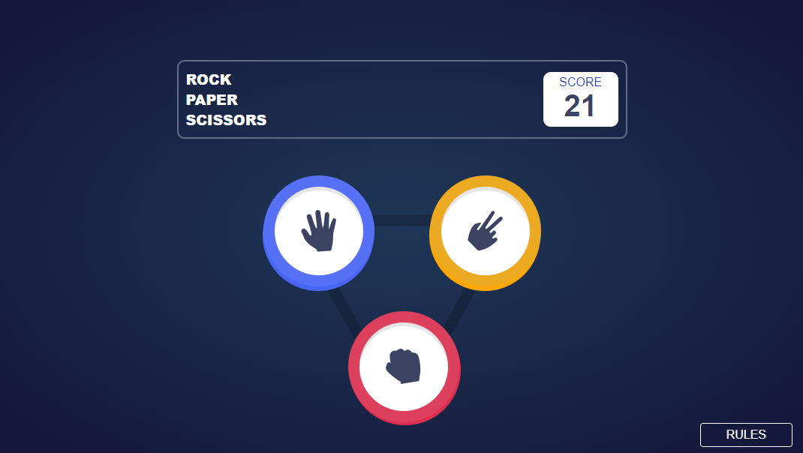
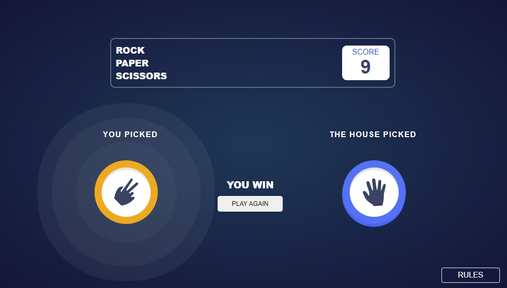
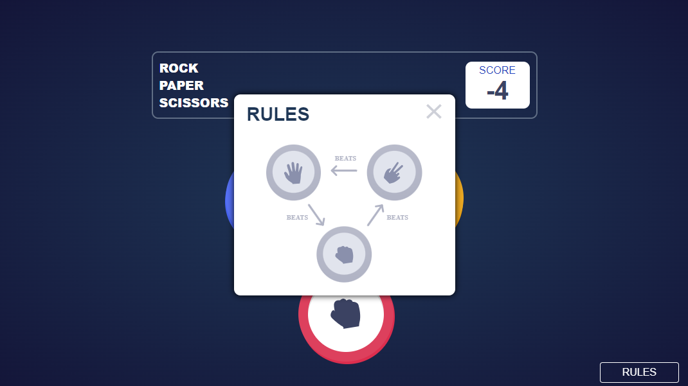

# ROCK | PAPER | SCISSORS - UI Game

This is a simple Game developed by **Rakesh Deep** ( [FontendMentor page](https://www.frontendmentor.io/profile/blackcat-web), [github page](https://www.github.com/blackcat-web/) ). A responsive UI developer and designer.

## Table of contents

- [Overview](#overview)
  - [Screenshot](#screenshot)
  - [Links](#links)
- [My process](#my-process)
  - [Built with](#built-with)
  - [Useful resources](#useful-resources)
- [Author](#author)
- [Acknowledgments](#acknowledgments)

## Overview

### Screenshot

### Links

- Solution URL: [Repository](https://github.com/blackcat-web/rock-paper-scissor)
- Live Site URL: [Live Game](https://blackcat-web.github.io/rock-paper-scissor/)

## My process

### Built with

- Semantic HTML5 markup
- CSS custom properties
- Flexbox
- CSS Grid
- Mobile-first workflow
- [React](https://reactjs.org/) - JS library
- [Next.js](https://nextjs.org/) - React framework
- [Styled Components](https://styled-components.com/) - For styles

### Useful resources

- [W3schools](https://www.w3schools.com) - This site help me a lots while I am go deeper into web development and every time I stuck in some kind of layout problem I visit to [w3schools](https://www.w3schools.com/) and almost I get my solution.
- [Github](https://www.github.com) - Github is really a amazing platform where I use to push my repositories and it is be like **Mentos zinddagi** while using github.
- [CodePen](https://www.codepen.io) - CodePen is really cool place where I use to store my nonsense codes (._.) and It is really amazing site for me.

## Author
- Frontend Mentor - [@blackcat-web](https://www.frontendmentor.io/profile/blackcat-web)
- Github - [Rakesh](https://www.github.com/blackcat-web/)
- CodePen - [@black-ninja](https://codepen.io/Black-ninja)
- Instagram - [Rakesh Deep](https://www.instagram.com/rakeshdeepp/)

## Acknowledgments

This is where you can give a hat tip to anyone who helped you out on this project. Perhaps you worked in a team or got some inspiration from someone else's solution. This is the perfect place to give them some credit.
